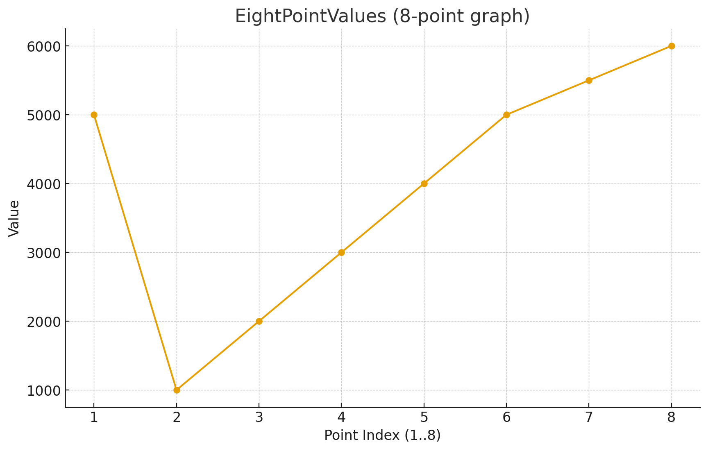

Editor_Format
=============

This page explains the editor's on-disk and translation-layer data structures.
It does not describe the full operational editing workflow. For lifecycle,
mutation, persistence, and history behavior, read :doc:`Editor_Workflows`.

The editor stack uses two storage layers:

- human-editable JSON working files used by the timeline/editor code
- binary and root-database payloads used by `trackdata` and `musdata`

The current source of truth for JSON key names is
`include/core/editor/TimeLine/JSONWrap/jsonWrapper.hpp`.

Semantic Model
--------------

PDJE editor data is easier to understand if you split it into four semantic
layers:

- `trackdata`
  the root-database unit that represents an authored track. It stores a track
  title plus serialized mix and note payloads, along with a cached list of
  referenced music titles.
- `musdata`
  the root-database unit for a concrete music asset. It stores title, composer,
  path, BPM information, and `firstBeat`.
- `MixArgs`
  timeline data that changes playback or processing behavior over musical time.
  Current mix categories include `FILTER`, `EQ`, `DISTORTION`, `CONTROL`,
  `VOL`, `LOAD`, `UNLOAD`, `BPM_CONTROL`, `ECHO`, `OSC_FILTER`, `FLANGER`,
  `PHASER`, `TRANCE`, `PANNER`, `BATTLE_DJ`, `ROLL`, `COMPRESSOR`, and
  `ROBOT`.
- `NoteArgs`
  chart and judgment data. These rows describe note timing, note metadata, and
  the target `railID`.

`MusicArgs` is the bridge between the music metadata side and the BPM timeline
side of the editor. It records a BPM value plus a beat-position tuple.

Root Database Payloads
----------------------

.. doxygenstruct:: trackdata
   :project: Project_DJ_Engine

.. doxygenstruct:: musdata
   :project: Project_DJ_Engine

`trackdata` stores:

- `trackTitle`
- `mixBinary`
- `noteBinary`
- `cachedMixList`

The root-database column layout for tracks is:

.. list-table:: Track Data Format
   :header-rows: 1
   :widths: 25 25 25 25

   * - `TrackTitle`
     - `MixBinary`
     - `NoteBinary`
     - `CachedMixList`
   * - Text
     - Binary (Cap'n Proto)
     - Binary (Cap'n Proto)
     - Text (CSV)

`musdata` stores:

- `title`
- `composer`
- `musicPath`
- `bpmBinary`
- `bpm`
- `firstBeat`

The root-database column layout for music metadata is:

.. list-table:: Music Meta Data Format
   :header-rows: 1
   :widths: 20 20 20 15 20 15

   * - `Title`
     - `Composer`
     - `MusicPath`
     - `Bpm`
     - `BpmBinary`
     - `FirstBeat`
   * - Text
     - Text
     - Text
     - Double
     - Binary (Cap'n Proto)
     - TEXT

The binary fields are produced by the editor translation layer and then written
into the root database. They are not intended to be edited by hand.

`firstBeat` is important operationally: in the current source it is used as the
PCM-frame offset where the first musical beat begins for that audio asset.

Editor Argument Shapes
----------------------

.. doxygenstruct:: MixArgs
   :project: Project_DJ_Engine

.. doxygenstruct:: NoteArgs
   :project: Project_DJ_Engine

.. doxygenstruct:: MusicArgs
   :project: Project_DJ_Engine

These three structs describe the semantic payload handled by the editor code
before rendering to binary:

- `MixArgs`
  one mix/event row with type, detail enum, free-form string arguments, and a
  start/end musical position
- `NoteArgs`
  one note row with note type/detail, arguments, start/end position, and
  `railID`
- `MusicArgs`
  music timing metadata used by the music BPM editor flow

The older editor reference docs also included compact field tables that are
still useful when authoring or reviewing raw data rows.

.. list-table:: Mix Data Format
   :header-rows: 1
   :widths: 15 15 10 12 12 12 10 10 12 10 10 12

   * - `type`
     - `details`
     - `ID`
     - `first`
     - `second`
     - `third`
     - `beat`
     - `subBeat`
     - `separate`
     - `Ebeat`
     - `EsubBeat`
     - `Eseparate`
   * - `TYPE_ENUM`
     - `DETAIL_ENUM`
     - int
     - TEXT
     - TEXT
     - TEXT
     - long
     - long
     - long
     - long
     - long
     - long

The table below preserves the older author-facing labels because it captures
how `first`, `second`, and `third` are interpreted for each mix type. Current
source names such as `BPM_CONTROL` and `OSC_FILTER` map to the older
`bpmControl` and `OCS_Filter` spellings shown here.

.. csv-table:: Mix Data Table
   :header: "type", "ID", "details", "first", "second", "third", "Interpolated Value"
   :widths: 15, 10, 35, 20, 20, 30, 20

   "FILTER(0)", "ID", "HIGH(0)/LOW(2)", "ITPL", "8PointValues", "NONE", "filter Frequency"
   "EQ(1)", "ID", "HIGH(0)/MID(1)/LOW(2)", "ITPL", "8PointValues", "NONE", "eq value"
   "DISTORTION(2)", "ID", "0", "ITPL", "8PointValues", "NONE", "drive value"
   "CONTROL(3)", "ID", "PAUSE(3)/CUE(4)", "approx_loc", "X", "NONE", "NONE"
   "VOL(4)", "ID", "TRIM(5)/FADER(6)", "ITPL", "8PointValues", "NONE", "volume"
   "LOAD(5)", "ID", "0", "title", "composer", "bpm", "NONE"
   "UNLOAD(6)", "ID", "0", "X", "X", "NONE", "NONE"
   "bpmControl(7)", "ID", "timeStretch(7)", "BPM(double)", "NONE", "NONE", "NONE"
   "ECHO(8)", "ID", "0", "ITPL", "8PointValues", "BPM, feedback", "Wet amount"
   "OCS_Filter(9)", "ID", "HIGH(0)/LOW(2)", "ITPL", "8PointValues", "BPM, MiddleFreq, RangeHalfFreq", "Wet amount"
   "FLANGER(10)", "ID", "0", "ITPL", "8PointValues", "BPM", "Wet amount"
   "PHASER(11)", "ID", "0", "ITPL", "8PointValues", "BPM", "Wet amount"
   "TRANCE(12)", "ID", "0", "ITPL", "8PointValues", "BPM, GAIN", "Wet amount"
   "PANNER(13)", "ID", "0", "ITPL", "8PointValues", "BPM, GAIN", "Wet amount"
   "BATTLE_DJ(14)", "ID", "SPIN(8)/PITCH(9)/REV(10)", "SPEED", "NONE", "NONE", "NONE"
   "BATTLE_DJ(14)", "ID", "SCRATCH(11)", "StartPosition", "SPEED", "NONE", "NONE"
   "ROLL(15)", "ID", "0", "ITPL", "8PointValues", "BPM", "Wet amount"
   "COMPRESSOR(16)", "ID", "0", "Strength", "Thresh, Knee", "ATT, REL", "NONE"
   "ROBOT(17)", "ID", "0", "ITPL", "8PointValues", "ocsFreq", "Wet amount"

.. list-table:: Note Data Format
   :header-rows: 1
   :widths: 15 20 15 15 15 12 12 12 12 12 12 12

   * - `Note_Type`
     - `Note_Detail`
     - `first`
     - `second`
     - `third`
     - `beat`
     - `subBeat`
     - `separate`
     - `Ebeat`
     - `EsubBeat`
     - `Eseparate`
     - `RailID`
   * - TEXT
     - uint16
     - TEXT
     - TEXT
     - TEXT
     - long
     - long
     - long
     - long
     - long
     - long
     - uint64

Time And Position Model
-----------------------

The timeline fields follow the beat-grid style layout used across the editor
and translators:

- `beat`
  whole-beat index
- `subBeat`
  subdivision index inside the current beat
- `separate`
  subdivision denominator
- `e_beat`, `e_subBeat`, `e_separate`
  end-position tuple for duration-based events

In the current frame calculation helpers, the approximate position is handled
as:

`beat + (subBeat / separate)`

with zero `separate` values treated as `1` by the translation path when needed.

This means:

- a simple point event only needs the start position
- sustained notes or automation spans use the `e_*` fields too
- mix automation and long-note style data both reuse the same timing model

Interpolation And `EightPointValues`
------------------------------------

The runtime mix path still contains an explicit `EightPointValues` parser in
`MixMachine.hpp`. Older docs referred to these comma-separated control values as
`8PointValues`, and that term is still useful for understanding the editor
format.

Operationally:

- `MixArgs.first` often carries an interpolation selector
- `MixArgs.second` often carries the comma-separated control values
- the runtime renderer converts those values into time-varying control curves
  between the start and end positions

The interpolation-related runtime enums in the tree are:

- `ITPL_LINEAR`
- `ITPL_COSINE`
- `ITPL_CUBIC`
- `ITPL_FLAT`

.. list-table:: Interpolation Keywords
   :header-rows: 1
   :widths: 20 80

   * - Keyword
     - Meaning
   * - `ITPL`
     - Choose the interpolator type (`linear`, `cosine`, `cubic`, or `flat`)
   * - `8PointValues`
     - Eight data points that define the waveform used by the interpolator

Example control string:

.. code-block:: c++

   std::string points = "5000,1000,2000,3000,4000,5000,5500,6000";

Read that example as eight control points stretched across the event span from
the start beat tuple to the end beat tuple. This is the model older docs used
to explain automated filter, EQ, volume, and other FX changes, and it still
matches the current runtime parser.

With `ITPL_FLAT`, older examples used a single value because the control is not
meant to interpolate across a curve. That guidance still matches the flat
interpolator concept in the current tree.

JSON Working Sets
-----------------

`jsonWrapper.hpp` defines the current root object names:

- `PDJE_MIX`
- `PDJE_NOTE`
- `PDJE_MUSIC_BPM`

It also defines the field keys below.

Mix JSON Keys
~~~~~~~~~~~~~

.. list-table::
   :header-rows: 1

   * - Key
     - Meaning
   * - `type`
     - integer `TypeEnum` value
   * - `details`
     - integer `DetailEnum` value
   * - `id`
     - logical target ID
   * - `first`
     - first free-form argument
   * - `second`
     - second free-form argument
   * - `third`
     - third free-form argument
   * - `beat`
     - start beat
   * - `sub_beat`
     - start subdivision index
   * - `separate`
     - start subdivision denominator
   * - `e_beat`
     - end beat
   * - `e_subBeat`
     - end subdivision index
   * - `e_separate`
     - end subdivision denominator

Note JSON Keys
~~~~~~~~~~~~~~

Note rows reuse the same timeline position keys as mix rows and add:

- `note_type`
- `note_detail`
- `rail_id`

`note_type` is intentionally open text in the current editor model. One special
reserved value is visible in the current translator path:

- note type exactly equal to `BPM`

`NoteTranslator` treats `BPM` rows as tempo fragments rather than normal
judged notes. This is the current source-backed behavior and is narrower than
the older "BPM-prefixed note" phrasing.

Music JSON Keys
~~~~~~~~~~~~~~~

Music metadata and BPM editor flows use:

- `title`
- `composer`
- `path`
- `bpm`
- `first_beat`

The `MusicArgs` helper itself carries `bpm`, `beat`, `subBeat`, and `separate`
for the BPM-timeline side of the editor.

Example JSON Fragments
----------------------

Mix row:

.. code-block:: json

   {
     "type": 1,
     "details": 0,
     "id": 0,
     "first": "0",
     "second": "0,0,0,0,0,0,0,0",
     "third": "",
     "beat": 32,
     "sub_beat": 0,
     "separate": 1,
     "e_beat": 40,
     "e_subBeat": 0,
     "e_separate": 1
   }

Note row:

.. code-block:: json

   {
     "note_type": "TAP",
     "note_detail": 0,
     "first": "",
     "second": "",
     "third": "",
     "beat": 16,
     "sub_beat": 0,
     "separate": 1,
     "e_beat": 0,
     "e_subBeat": 0,
     "e_separate": 0,
     "rail_id": 1
   }

Translation Layer
-----------------

The current conversion path is:

1. JSON working files are manipulated through `PDJE_JSONHandler`.
2. `CapWriter<MixBinaryCapnpData>`, `CapWriter<NoteBinaryCapnpData>`, and
   `CapWriter<MusicBinaryCapnpData>` serialize the working representation.
3. `MixTranslator`, `MusicTranslator`, and `NoteTranslator` deserialize those
   binaries into runtime structures such as `MIX`, `BPM`, and note callbacks.

This split is important:

- JSON is the editor-friendly working representation
- binary payloads are the runtime-facing data stored in the root DB

For the operational side of the editor, including `AddLine()`, `deleteLine()`,
history navigation, preview playback, and the distinction between `render()`
and `pushToRootDB()`, use :doc:`Editor_Workflows`.
